# Tutorial Berbisnis
Berbisnis merupakan aplikasi Penjualan Kasir & Pencatatan Keuangan.

## Fitur Berbisnis
- Kasir
- Kulakan
- PPN
- Catatan Keuangan
- Riwayat Transaksi
- Laporan Penjualan Barang
- Laporan Pembelian Barang
- Hutang dan Piutang
- Kelola barang etalase
- Pelanggan
- Diskon
- Multi Pengguna
- Sinkronisasi antar device
- Bicoin
- Mode Offline

## Informasi BiCoin
Berbisnis menggunakan **BiCoin** sebagai sarana bayar *UTAMA* agar dapat terus digunakan. 

Tiap data yang tersimpan dalam aplikasi berbisnis akan mengurangi saldo **BiCoin**.

Biaya dari Berbisnis dengan **BiCoin** adalah sebagai berikut

|    Jenis Data    |   Biaya       |
|------------------|:-------------:|
| Penjualan        | 10 BiCoin     |
| Catatan Keuangan | 10 BiCoin     |

### Notes
- Anda akan mendapatkan 10.000 **BiCoin** gratis saat pendaftaran awal.
- Anda juga bisa mendapatkan **BiCoin** gratis pada fitur
*BiCoin Reward* pada halaman Utama

***

## Tutorial  

### Instalasi Awal
1. **Login**
   - Klik Button Masuk
   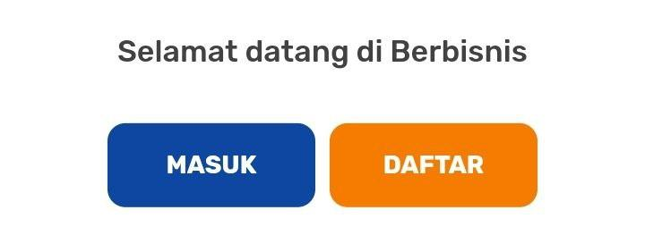 
   - Isikan Nomor HP   
   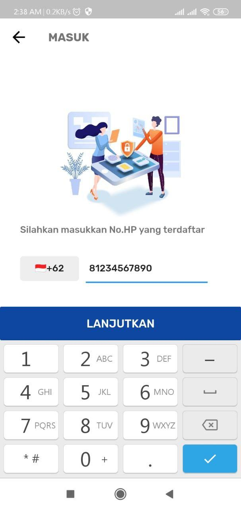  
   - Anda akan mendapatkan SMS ke nomor HP yang terlah dimasukkan
   - Masukkan kode yang didapat dari SMS
   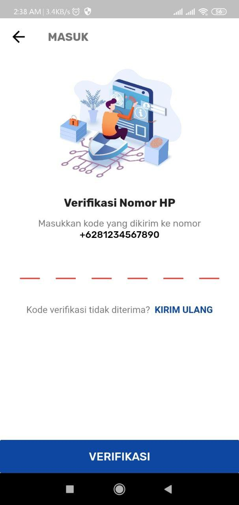 
2. **Halaman Utama**
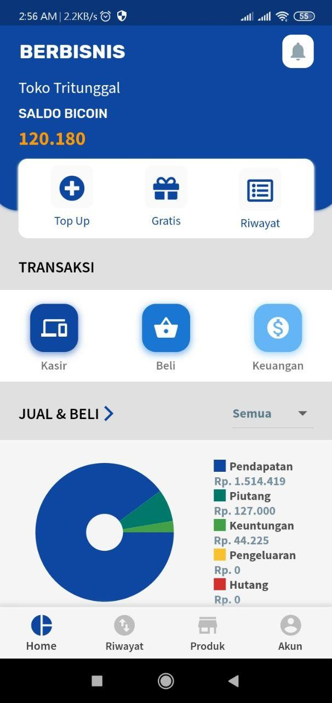 
3. **Kelola Barang**
   - Masuk Ke Menu Etalase
   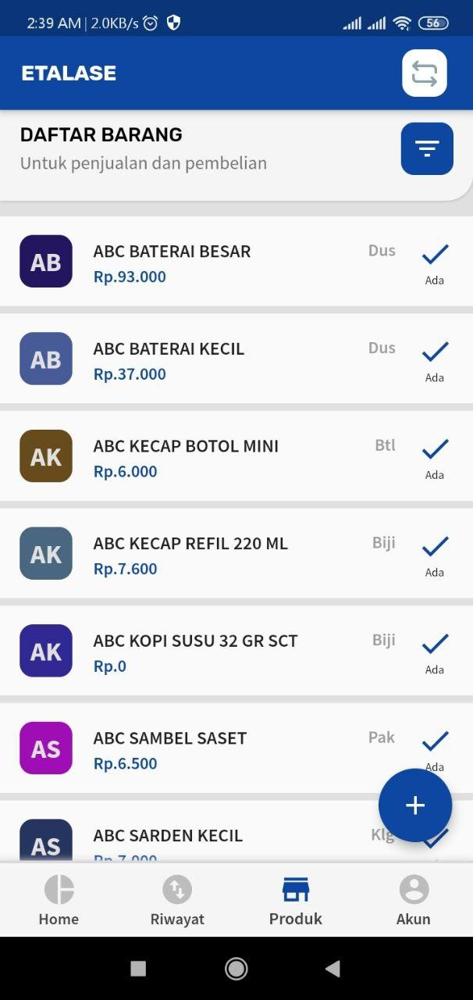 
   - **Cari**
     - Klik Tombol "+"
     - Ketik barang yang ingin anda tambah 
      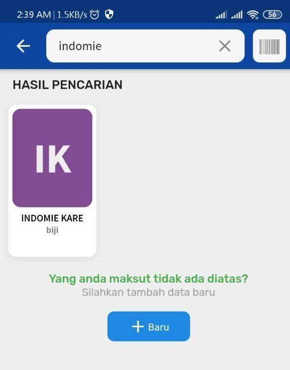 
     - Klik pada barang yang dimaksut 
     - Jika sudah sesuai, klik Tombol "v" (Kanan Atas)
   - **Tambah Baru**
     - Pada Halaman Pencarian (Jika barang tidak ditemukan)
     - Klik Tombol "+ Baru"
      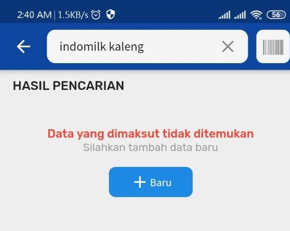 
     - Isikan data sesuai barang anda 
      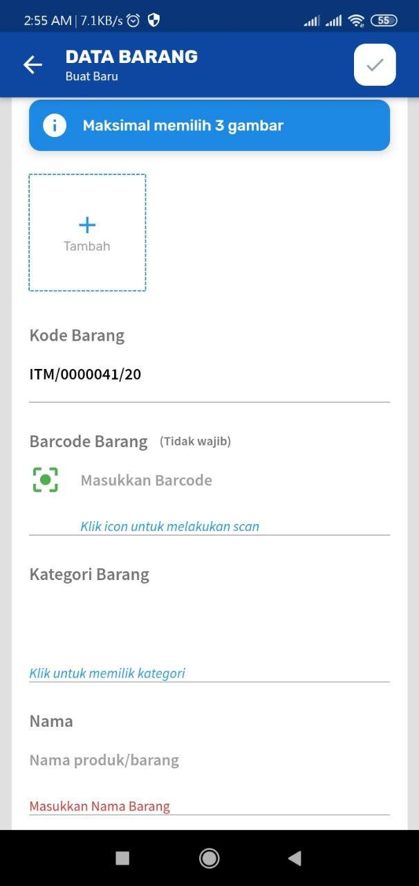 
     - Jika sudah sesuai, klik Tombol "v" (Kanan Atas)
   - **Ubah Harga**
     - Pada Halaman Etalase
     - Klik salah satu barang    
      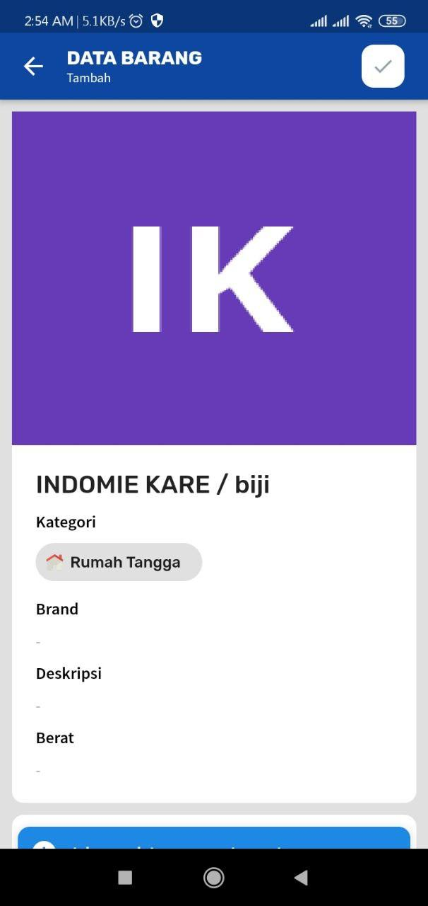 
     - Jika sudah sesuai, klik Tombol "v" (Kanan Atas)  
   - **Hapus**
     - Pada Halaman Etalase
     - Slide Ke Kanan salah satu barang   
      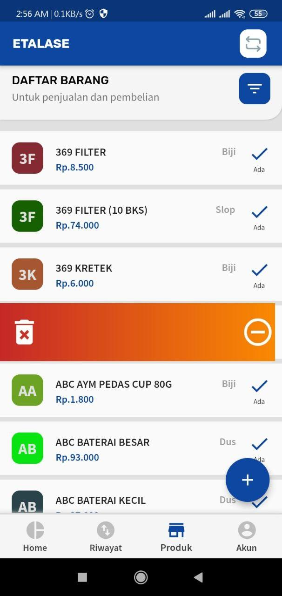 
### Transaksi
3. Kasir
   - Pada Halaman Utama
   - Klik Menu Kasir
      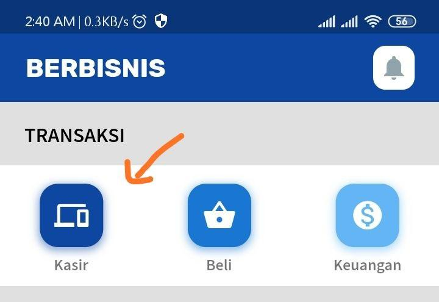 
   - Klik Tombol "Buka Toko" (Jika belum)
      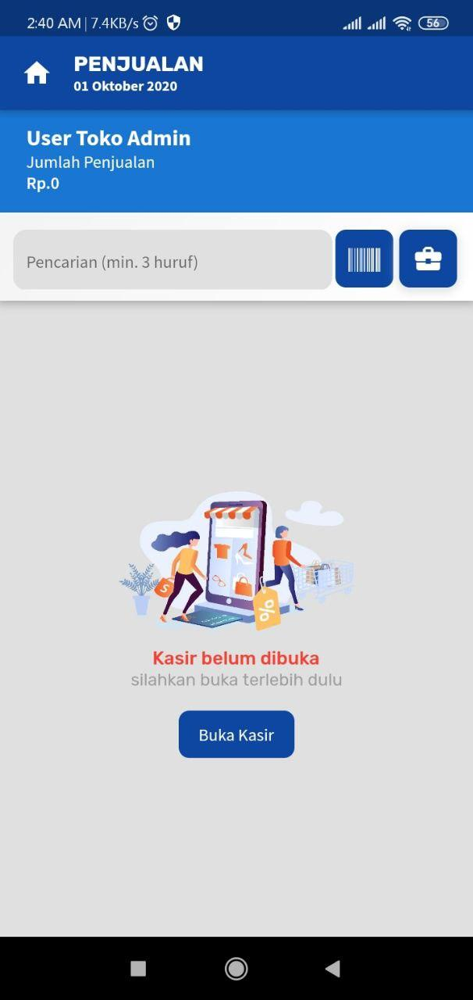 
   - Klik Barang yang dijual
      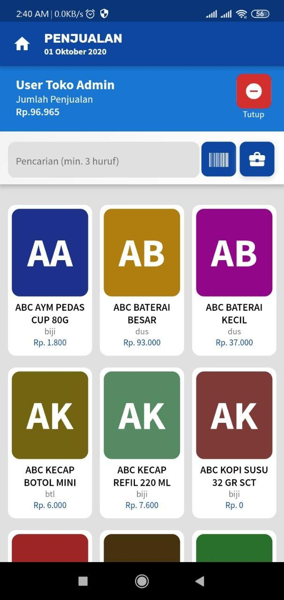 
   - Klik Tombol dengan Icon "Keranjang"
   - Periksa Data Penjualan
      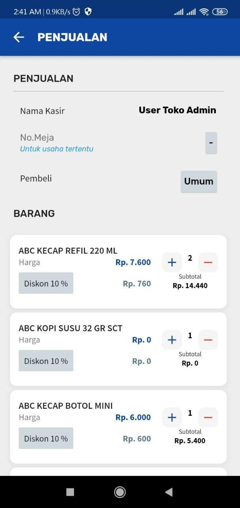 
   - Lanjut Pembayaran
      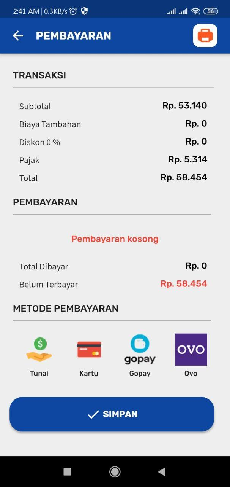 
   - Pilih Metode Pembayaran
      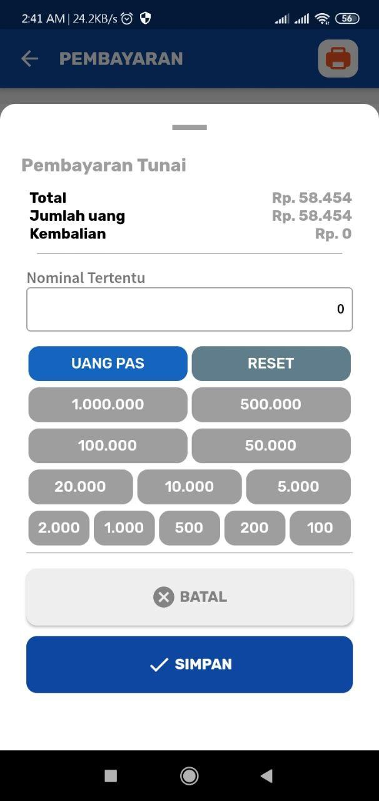 
   - Selesai 
      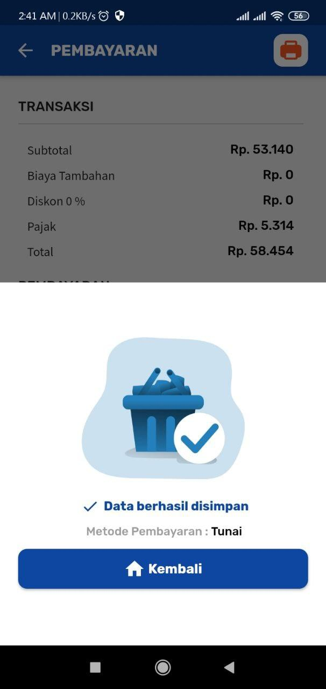 
4. Pencatatan Keuangan
   - Pada Halaman Utama
   - Klik Menu Keuangan
   - Klik Tombol "+"
   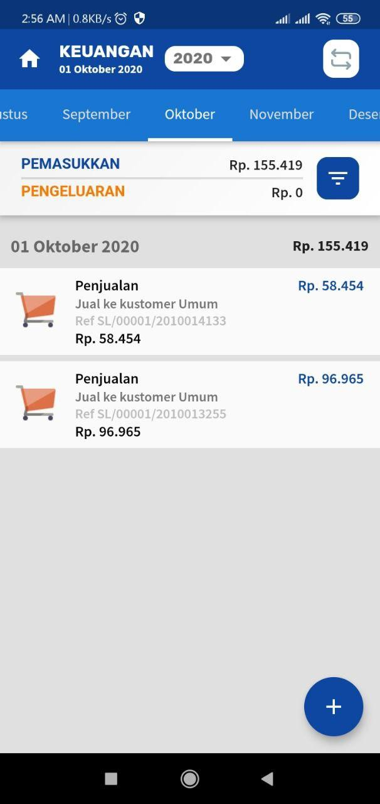  
   - Masukkan data catatan
   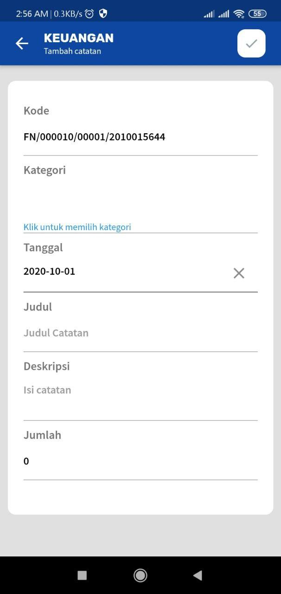
   - Pilih Kategori Catatan 
   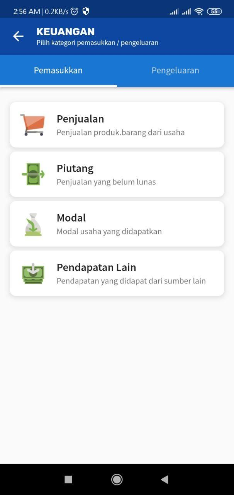  
   - Jika sudah sesuai, klik Tombol "v" (Kanan Atas)  